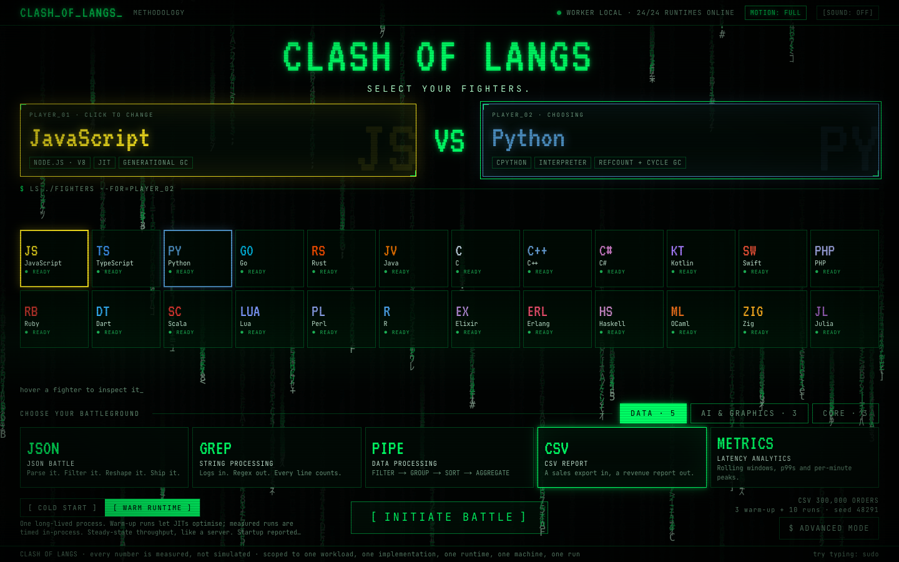
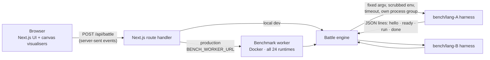
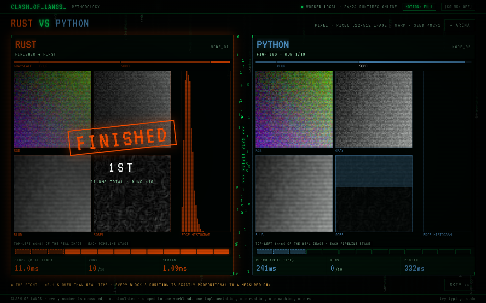

<div align="center">

# Clash of Langs

**Pick two programming languages. Give them the same challenge. Watch them fight.**

Real processes, real runtimes and seeded identical inputs, and every result is checked to be identical before anyone wins.

**[▶ Try it live at clash-of-langs.vercel.app](https://clash-of-langs.vercel.app)**

[](https://github.com/Alex90Jennings/clash-of-langs/actions/workflows/ci.yml)
[](LICENSE)


[](CONTRIBUTING.md)



</div>

## Why?

"Is Go faster than Python?" usually gets answered with a micro-benchmark that does less work in one language, times compilation in another, and reports one lucky run. Clash of Langs is an arena built on the opposite approach:

- **Same work.** Both fighters regenerate the same input from a shared seed and must produce the **same checksum**. If they don't, the battle is invalid and nobody wins.
- **Real runtimes.** Nothing runs in WebAssembly or as a simulation. Each fighter is a native process: CPython, HotSpot, V8, BEAM, GHC-compiled binaries and so on.
- **Honest statistics.** The headline is the median, not the best run. Outliers are flagged, not hidden. A winner is only declared if a Mann–Whitney U test says the difference is significant (p < 0.05). Otherwise it's a **DRAW**.
- **Scoped claims.** Every result is labelled as one workload, one implementation, one runtime and one machine, with the exact versions and command lines attached.

## Features

- ⚔️ **24 fighters, all real.** Every language below runs as its own process. A missing toolchain shows as **OFFLINE** and is never faked.
- 🏟️ **11 real-world battlegrounds, implemented in every language:**
  - *Data:* JSON transform, log parsing (regex), group-by aggregation, a CSV sales report, latency analytics (rolling windows and p99s)
  - *AI & graphics:* int8 neural-network inference, vector search (RAG-style top-k retrieval), an image pipeline (grayscale → blur → Sobel edges)
  - *Core:* sorting, hash vs binary search, a prime sieve
- 🔬 **COLD vs WARM modes.** Measure fresh-process startup (JIT warm-up included) or steady-state throughput after warm-up runs.
- 📊 **Full results.** Performance, memory (peak and baseline RSS), startup, CPU time, a WHY? panel explaining the difference, and the raw JSON.
- ✅ **Cross-runtime verification.** `npm run bench:verify` checks that all 24 harnesses produce byte-identical inputs and outputs for every challenge.
- 🔗 **Reproducible URLs.** `/battle/javascript-vs-go/csv?seed=…` replays the exact battle.
- 🐳 **One Docker image with every runtime**, pinned and hardened, for a production benchmark worker.
- 🥚 Easter eggs. Try typing `sudo`.

### The roster

| Execution model | Fighters |
| --- | --- |
| Native, ahead-of-time | C, C++, Rust, Go, Zig, Swift, Haskell (GHC), OCaml, Dart (AOT) |
| JIT / managed VM | Java, Kotlin, Scala (HotSpot) · C# (.NET CoreCLR) · JavaScript, TypeScript (V8) · Julia (LLVM) · Ruby (YJIT) · Elixir, Erlang (BEAM) |
| Interpreted | Python (CPython), PHP (Zend), Lua (PUC-Rio), Perl 5, R |

## How it works



1. You pick two fighters, a challenge and a mode. The config is whitelisted and clamped, and it only ever becomes argv integers. No user text reaches a shell.
2. The engine takes an exclusive lock, randomises which fighter goes first, and runs each harness under `/usr/bin/time` to capture peak memory and CPU time.
3. Each harness streams [JSON events](bench/SPEC.md#output-protocol) with in-process monotonic timings for only the timed step. Input generation and copies happen outside the timer.
4. The engine checks the input hashes and output checksums, computes the statistics and streams the result back to the UI as it happens.



The full methodology is in [`docs/BENCHMARKING.md`](docs/BENCHMARKING.md), and the system design and security model are in [`docs/ARCHITECTURE.md`](docs/ARCHITECTURE.md).

## Getting started

### Prerequisites

- **Node.js 20.9+** and npm
- The toolchains for the languages you want to run. You don't need all 24: anything missing just shows as OFFLINE. To get every language without installing anything, use [Docker](#option-b-docker-every-runtime-no-local-toolchains).

### Option A: local toolchains

```bash
git clone https://github.com/Alex90Jennings/clash-of-langs.git
cd clash-of-langs
npm install
npm run bench:build    # compiles the harness for every toolchain it finds
npm run bench:verify   # checks all available runtimes agree on inputs + outputs
npm run dev            # http://localhost:3000
```

<details>
<summary><b>Installing every toolchain on macOS (Homebrew)</b></summary>

```bash
brew install go rust dotnet kotlin scala php lua luarocks r ghc cabal-install ocaml opam zig julia dart-sdk ruby nlohmann-json cjson
opam init --bare -n
opam switch create clashoflangs ocaml-system
opam install --switch=clashoflangs yojson ocamlfind mtime
cabal update
npm run bench:build
```

If Homebrew's LLVM is on your `PATH`, native builds can fail to find the macOS SDK. `bench/build.sh` puts `/usr/bin` first for this reason. Do the same (`PATH="/usr/bin:$PATH"`) when you run `opam install`.

</details>

### Option B: Docker (every runtime, no local toolchains)

The worker image ships **all 24 runtimes** at pinned versions (Debian trixie base, about 2.2 GB):

```bash
export CLASHOFLANGS_WORKER_TOKEN=change-me
docker compose up -d --build worker
BENCH_WORKER_URL=http://localhost:8787 npm run dev

# check that all 24 runtimes agree inside the hardened container
docker compose run --rm worker node dist/verify.mjs
```

### Configuration

Copy `.env.example` to `.env.local`:

| Variable | Default | Purpose |
| --- | --- | --- |
| `BENCH_WORKER_URL` | *(unset)* | Remote benchmark worker. Leave it unset to run battles in-process. |
| `CLASHOFLANGS_WORKER_TOKEN` | *(unset)* | Shared secret between the app and the worker. |
| `CLASHOFLANGS_LOCAL_EXECUTION` | enabled | Set to `0` to turn off in-process execution, for example on a public host. |
| `CLASHOFLANGS_CPUSET` | `2,3` | Worker only (Docker Compose): the CPU cores the worker is pinned to. Use `0,1` on a 2-core host. |
| `CLASHOFLANGS_WORKER_ID` | `local-docker` | Worker only: the name shown with every result. |

### Scripts

| Command | What it does |
| --- | --- |
| `npm run dev` | Start the dev server |
| `npm run build` / `npm start` | Production build and serve |
| `npm run typecheck` | Type-check the project |
| `npm run bench:build` | Build the per-language harnesses in `bench/` |
| `npm run bench:verify` | Cross-check every available runtime against the others |
| `npm run worker` | Run the benchmark worker locally |

## Project structure

```text
src/
  app/           Next.js routes: UI pages and /api/{battle,capabilities}
  components/    Arena, battle and results UI
  engine/        Server-only: runtime adapters, process measurement, orchestration
  lib/           Languages, challenges, stats (Mann–Whitney U), insights, config
  visualizers/   One canvas renderer per challenge
bench/
  <lang>/        One harness per language (24)
  SPEC.md        The cross-language harness contract
  build.sh       Builds every harness whose toolchain is present
worker/          Standalone benchmark worker + hardened Dockerfile
scripts/         Cross-runtime verification
docs/            Architecture and benchmarking methodology
```

## Deployment

| Piece | Where | Notes |
| --- | --- | --- |
| Frontend + API | Vercel or any Next.js host | Set `BENCH_WORKER_URL` and `CLASHOFLANGS_WORKER_TOKEN`. |
| Benchmark worker | A **dedicated-CPU** VM running `worker/Dockerfile` | Serverless platforms can't run these runtimes and don't give stable timings. |

Without a worker, the deployed UI shows **ARENA OFFLINE** instead of making up numbers.

## Roadmap

- [x] 24 languages × 11 battlegrounds, verified bit-identical
- [x] COLD / WARM modes, significance testing, raw results
- [x] Hardened all-runtimes worker image
- [ ] Shareable result permalinks and Open Graph result cards
- [ ] More battlegrounds (ideas welcome: compression, hashing, graph analytics, text tokenisation)
- [x] Per-visitor rate limiting and a public worker behind HTTPS
- [ ] Egress firewall on the worker (harnesses never need the network)
- [ ] gVisor or Firecracker sandboxing, a prerequisite for ever accepting user-submitted code

Ideas and votes are welcome in [issues](https://github.com/Alex90Jennings/clash-of-langs/issues).

## Contributing

Contributions are very welcome, especially:

- **Making an implementation more idiomatic or fair.** If your language looks slow because of how it's written, show us.
- **Adding a language or a challenge.**
- **Fixing bugs, UI polish and docs.**

Read [CONTRIBUTING.md](CONTRIBUTING.md) before you start. The one hard rule: **`npm run bench:verify` must pass**, because every language has to produce identical output.

## Security

Clash of Langs only runs the harnesses that ship in this repository. It never runs code submitted by users. Please report vulnerabilities privately, as described in [SECURITY.md](SECURITY.md).

## Acknowledgements

The methodology builds on [The Computer Language Benchmarks Game](https://benchmarksgame-team.pages.debian.net/benchmarksgame/), [hyperfine](https://github.com/sharkdp/hyperfine), and the warm-up and variance practices of JMH, pyperf and criterion.

## License

[MIT](LICENSE)
